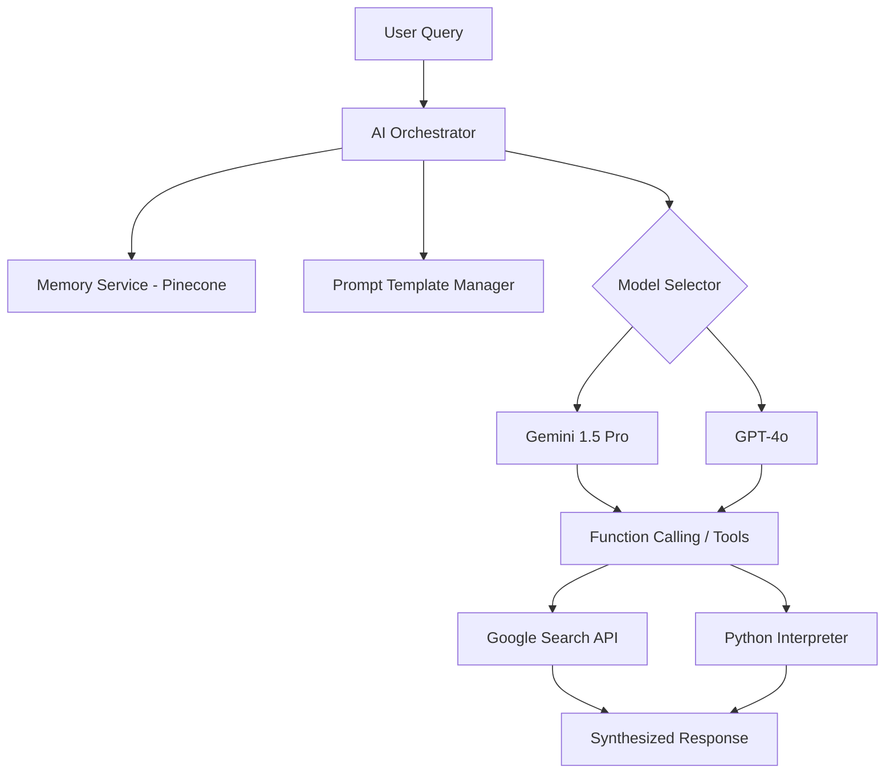

# 🧠 Nexus AI: Intelligence Integration Engine

This document defines the core logic for the Nexus AI Multi-Model Orchestrator. It handles reasoning, memory retrieval, and tool execution.

---

## 1. Multi-Model Orchestration Architecture

---

## 2. Intelligence Modules

### A. Memory Retrieval (RAG)
- **Embeddings:** Using `text-embedding-004` (Gemini) or `text-embedding-3-small` (OpenAI).
- **Vector Storage:** Pinecone Serverless.
- **Flow:** 
    1. Input Query -> Generate Embedding.
    2. Search Pinecone for Top-K relevant chunks.
    3. Inject chunks into the "System Instructions" as Context.

### B. Prompt Engineering Strategy
- **Base System Prompt:** Defines the "Nexus Universe" personality.
- **Dynamic Context Injection:** Adds user-specific facts retrieved from the Memory Service.
- **Tool Definitions:** JSON schemas defining what the AI can *do* (e.g., `generate_image`, `scan_pdf`).

### C. Streaming & Token Optimization
- **Token Pruning:** Automatically truncates older conversation history if context window limits are reached.
- **Streaming Response:** Word-by-word token delivery via Server-Sent Events (SSE).

---

## 3. Cost & Performance Optimization
- **Flash Models for Routing:** Use Gemini 1.5 Flash to classify queries (e.g., Is this a simple chat or a complex research task?).
- **Pro Models for Reasoning:** Route research/coding tasks to Gemini 1.5 Pro.
- **Caching:** Cache common search queries to reduce API costs.

---

**Architect's Note:** This layer is the "Brain" of the entire ecosystem. It abstracts the specific AI provider, allowing us to swap Gemini for OpenAI (or vice versa) without breaking the Frontend.
