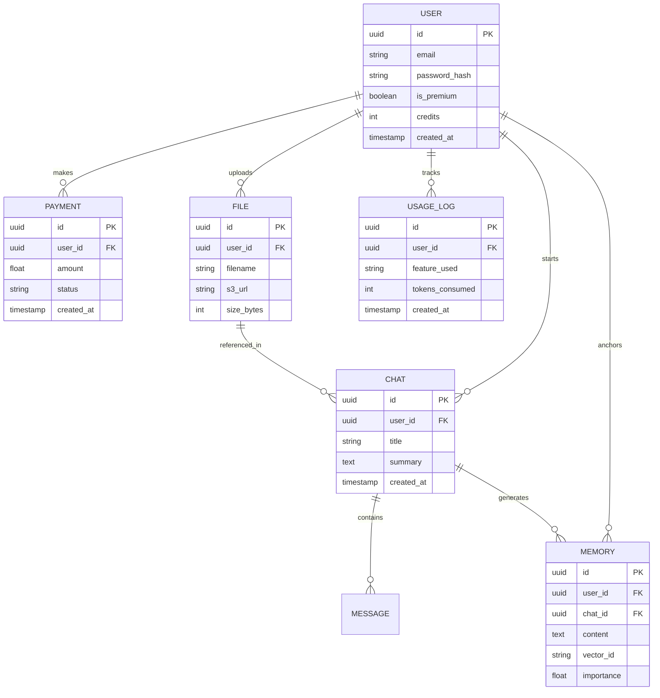

# 🗺️ Nexus AI: Entity Relationship (ER) Diagram

This diagram visualizes the core relationships between users, their intelligence (memories), and the business layer (payments).

---

**Architect's Note:** Every relationship is designed for **Cascading Deletes**. If a user deletes their account, all related chats, files, and memories are instantly purged to ensure 100% GDPR compliance.
