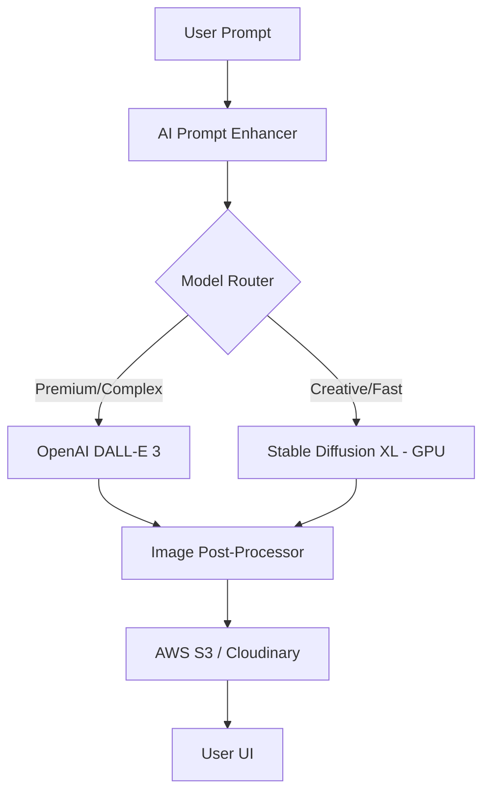

# 🎨 Nexus AI: Multimodal Image Generation Engine

The Nexus Image Engine provides high-fidelity visual creation capabilities. It combines the raw power of **Stable Diffusion XL** with the prompt-understanding of **DALL-E 3**.

---

## 1. Hybrid Architecture

---

## 2. Advanced Features

### A. Prompt Enhancement (The "Magic Prompt")
- User prompt: "A futuristic city."
- Enhanced prompt: "A hyper-realistic futuristic cyberpunk city, neon lighting, 8k resolution, cinematic lighting, volumetric fog, Unreal Engine 5 render, highly detailed architectural elements."
- **How:** We use a small LLM (Gemini 1.5 Flash) to expand user ideas into professional art prompts.

### B. Image Editing & Background Removal
- **Background Removal:** Using `RMBG-1.4` or `Segment Anything (SAM)`.
- **Inpainting:** Using Stable Diffusion Inpainting models to allow users to "paint" changes onto generated images.

### C. Style Presets
- The engine supports one-click styles: **Anime, Cyberpunk, Oil Painting, 3D Render, Minimalist.**

---

## 3. GPU Deployment Strategy
- **Cloud Provider:** AWS (g4dn instances) or RunPod/Lambda Labs.
- **Serving:** We use **ComfyUI API** or **A1111 API** inside a Docker container for high-throughput generation.
- **Queueing:** Uses **Celery + Redis** to handle multiple concurrent generation requests without crashing the server.

---

**Architect's Note:** This system doesn't just "make pictures"—it understands art. By enhancing the prompt first, we ensure that even a simple user request results in a masterpiece.
