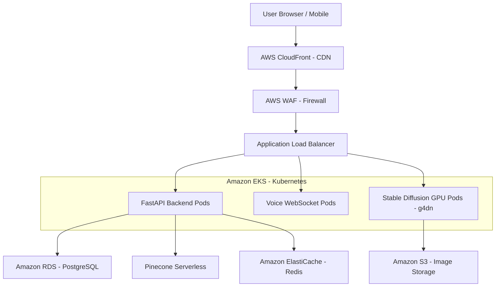

# ☁️ Nexus AI: Global Infrastructure & DevOps Blueprint

This document defines the production-grade deployment architecture for the Nexus AI Ecosystem on AWS.

---

## 1. High-Level Infrastructure (AWS)

---

## 2. Scaling & Reliability
- **Horizontal Pod Autoscaler (HPA):** Backend pods scale based on CPU/RAM usage.
- **Node Autoscaler (Karpenter):** Automatically spins up more AWS EC2 instances (including GPU nodes) when demand spikes.
- **Multi-AZ Deployment:** Resources are spread across 3 Availability Zones to ensure 99.9% uptime.

---

## 3. Security & Compliance
- **HTTPS/SSL:** Managed via **AWS Certificate Manager (ACM)**.
- **Secrets Management:** Sensitive keys (Gemini, ElevenLabs) are stored in **AWS Secrets Manager**.
- **WAF Rules:** Protection against SQL Injection, XSS, and DDoS attacks.

---

## 4. Monitoring & Logging
- **AWS CloudWatch:** For centralized logs and infrastructure metrics.
- **Prometheus & Grafana:** For real-time performance dashboards.
- **Sentry:** For error tracking and crash reporting in production.

---

**DevOps Note:** This architecture is designed for "Infinite Scale." Whether you have 100 users or 10 million, the system will automatically adapt its resources and costs to match the traffic.
