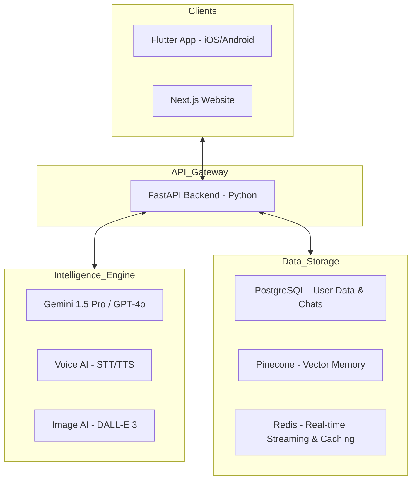

# 🏗️ Nexus Ultra: Professional AI Ecosystem Blueprint
**Architectural Roadmap for Android, iOS, and Web**

As a Senior AI Architect, I have designed this roadmap to take your project from a local prototype to a global, scalable production system.

---

## 1. High-Level Architecture


---

## 2. Phase-by-Phase Roadmap

### 🏁 Phase 1: The Core Backend (FastAPI & PostgreSQL)
*Setting up the brain and skeleton.*
- **Step 1:** Initialize FastAPI with Pydantic schemas.
- **Step 2:** Setup PostgreSQL (using SQLAlchemy/SQLModel).
- **Step 3:** Implement **JWT Authentication** (OAuth2).
- **Step 4:** Create a **Streaming Response Handler** using Server-Sent Events (SSE).

### 📱 Phase 2: Multi-Platform Frontend (Flutter & Next.js)
*Building the eyes and face.*
- **Step 1:** **Flutter:** Setup Bloc or Riverpod for state management.
- **Step 2:** **Next.js:** Use Tailwind CSS & Shadcn UI for the glassmorphic dashboard.
- **Step 3:** Implement the **WebSocket/SSE listener** for real-time typing effects.
- **Step 4:** Design the **Multimodal Input** (Microphone, Camera, File Upload).

### 🧠 Phase 3: AI Memory & Vector Systems (Pinecone)
*Giving the AI a long-term memory.*
- **Step 1:** Setup **Sentence-Transformers** or OpenAI Embeddings.
- **Step 2:** Configure **Pinecone Vector Database**.
- **Step 3:** Implement **RAG (Retrieval-Augmented Generation)**:
    1. User sends message.
    2. Backend converts message to vector.
    3. Query Pinecone for relevant "past memories".
    4. Inject memories into the AI Prompt.

### 🎨 Phase 4: Advanced Features (Voice, Image, Tools)
*Adding the superpowers.*
- **Step 1:** **Voice:** Integrate OpenAI Whisper (STT) and Google/Azure TTS.
- **Step 2:** **Image:** Connect to DALL-E 3 or Midjourney API via Replicate.
- **Step 3:** **Tool Calling:** Implement "Function Calling" so AI can use a Calculator, Fetch Weather, or Search Google.

### 💰 Phase 5: Monetization & Admin Panel
*Turning it into a business.*
- **Step 1:** Integrate **Stripe** for Pro Subscriptions.
- **Step 2:** Build the **Admin Dashboard** (Next.js) to monitor API costs, ban users, and manage models.
- **Step 3:** Implement **Tiered Access** (Free vs. Gold vs. Ultra).

### ☁️ Phase 6: Cloud Deployment & AWS Scalability
*Going global.*
- **Step 1:** Containerize with **Docker**.
- **Step 2:** Deploy Backend to **AWS ECS/Fargate**.
- **Step 3:** Frontend hosting on **Vercel** (Web) and **Firebase App Distribution** (Mobile).
- **Step 4:** Setup **CloudFront CDN** and **WAF (Web Application Firewall)** for security.

---

## 3. Project Folder Structure

### Backend (FastAPI)
```text
/backend
├── app/
│   ├── api/ (v1 routes)
│   ├── core/ (config, security)
│   ├── models/ (sql schemas)
│   ├── services/ (ai, vector_db, stripe)
│   └── main.py
├── tests/
├── Dockerfile
└── requirements.txt
```

### Web (Next.js)
```text
/web
├── components/ (ui, chat, sidebar)
├── hooks/ (useAuth, useStreaming)
├── pages/ (dashboard, login, profile)
├── styles/ (tailwind.css)
└── next.config.js
```

### Mobile (Flutter)
```text
/mobile
├── lib/
│   ├── bloc/ (logic)
│   ├── screens/ (chat, auth, settings)
│   ├── widgets/ (glass_card, message_bubble)
│   └── main.dart
├── pubspec.yaml
└── assets/
```

---

## 4. Critical Tech Workflow
1. **Security:** Use HTTPS, CORS protection, and Rate Limiting on FastAPI.
2. **Streaming:** Use `StreamingResponse` in FastAPI to send chunks of text instantly.
3. **PWA:** Ensure the Web app has a `manifest.json` for "Add to Home Screen" support on Chrome.
4. **Offline:** Use Hive or SQLite in Flutter for offline chat viewing.

---

**Architect's Note:** Start small. Build the **Web Dashboard** and **FastAPI Core** first. Once the API is stable, the Flutter app will simply be a "skin" over the same backend.
