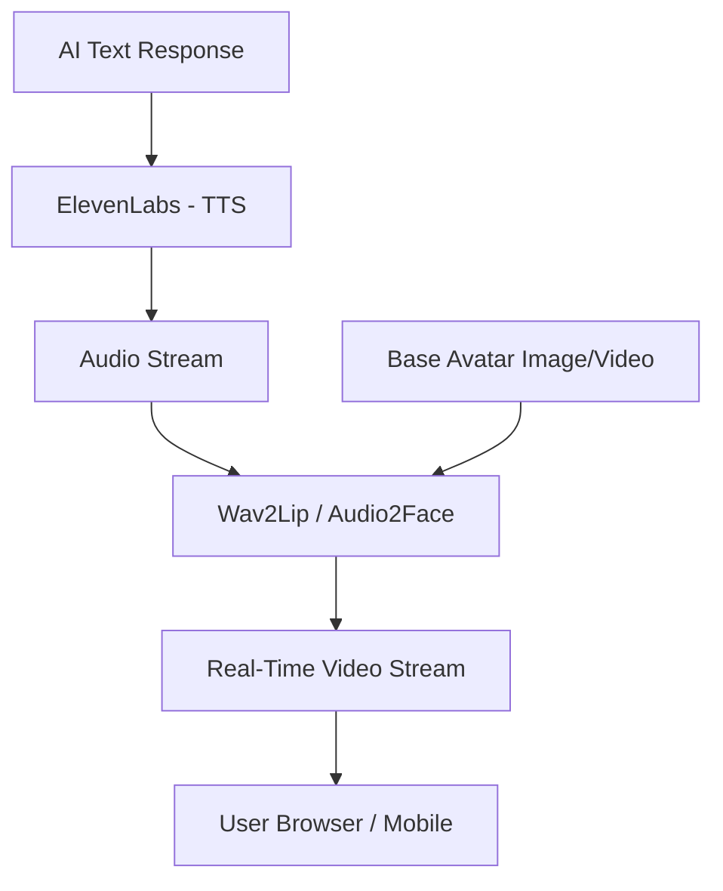

# 🎬 Nexus AI: Real-Time AI Video & Avatar System

The Nexus Video System brings the AI to life through high-fidelity video generation, avatars, and lip-syncing.

---

## 1. High-Level Architecture

---

## 2. Core Capabilities

### A. Text-to-Video (T2V)
- **Model:** **Stable Video Diffusion (SVD)** or **Runway Gen-2 API**.
- **Function:** Generate short (4-10 second) cinematic clips from text descriptions.

### B. AI Talking Avatars (Lip-Sync)
- **Model:** **SadTalker** or **LiveLink**.
- **Function:** Taking an image of an AI assistant (like the "Nexus Soul") and making it speak the AI's response in real-time with perfect lip-syncing.

### C. Video Summarization
- **Model:** Gemini 1.5 Pro (Video-to-Text).
- **Function:** Users upload a video -> Nexus analyzes the frames -> Provides a detailed timestamped summary and Q&A.

---

## 3. Deployment & Latency
- **GPU Requirement:** High-end NVIDIA A100 or H100 instances.
- **Streaming Protocol:** **WebRTC** for sub-200ms video delivery.
- **Optimization:** We use **Frame Interpolation** (RIFE) to generate smooth 60fps video while only rendering at 15fps.

---

**Architect's Note:** This is the ultimate expression of AI. By combining Voice, Memory, and Video, we create a "Digital Human" that is indistinguishable from reality in a spatial environment.
